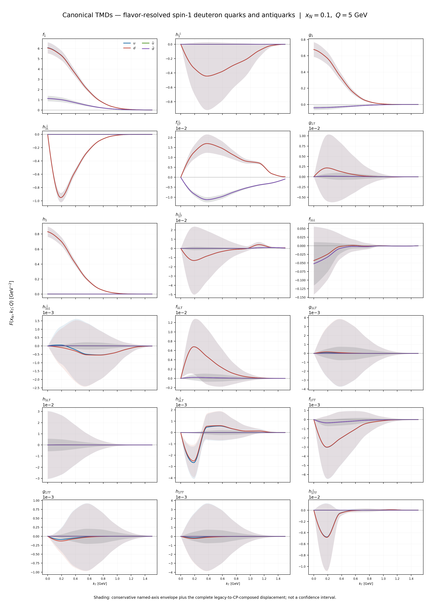
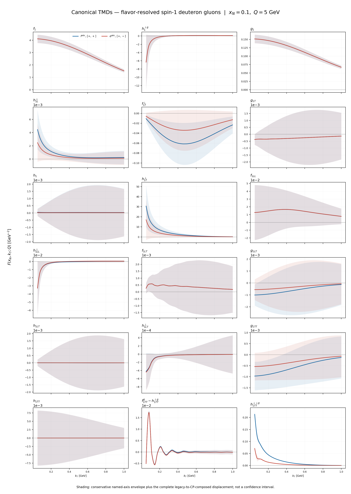
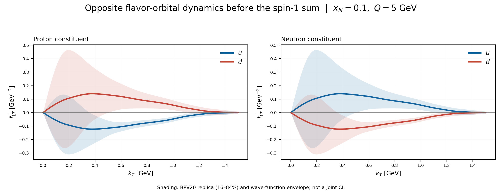
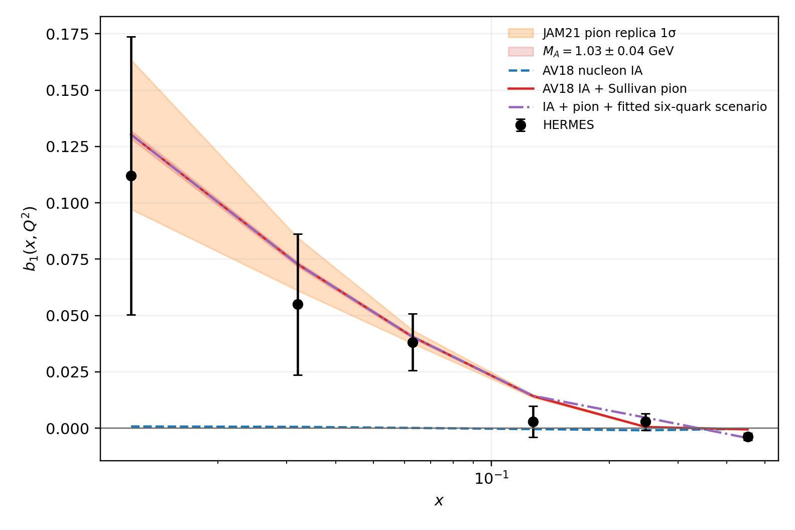

# DeuteronWigner

**DeuteronWigner constructs the complete leading-twist quark and gluon TMD
content of a spin-1 deuteron while preserving flavor, constituent, spin,
tensor-polarization, orbital, gauge-link, and nuclear-mechanism information.**

The project addresses a basic problem: a deuteron is not adequately described
by adding an isoscalar proton curve to an isoscalar neutron curve. Its
transverse structure depends on proton and neutron flavor dynamics, their
spin-orbit correlations, the deuteron *S*- and *D*-wave components, and
coherent nuclear mechanisms. Spin 1 also permits tensor-polarized structures
that do not exist for a spin-1/2 target.

The present release is a **correlator-level, phenomenologically constrained
boundary model**. It is designed to use everything presently supportable
without presenting underconstrained sectors as first-principles predictions.
It is already useful for studying flavor patterns, spin-1 observables,
nuclear mechanisms, uncertainty propagation, and the requirements of a
future microscopic calculation.

> **Scientific status:** the curves below are the result of a self-consistent
> phenomenological synthesis, not yet a solution of one common
> quark-gluon-nuclear light-front Hamiltonian. The evidence behind each sector
> ranges from global fits and measured observables to lattice guidance and
> explicit model assumptions. The code preserves that distinction.

## Results at a glance

The two atlases show the canonical deuteron TMD boundary at
x<sub>N</sub> = 0.1 and Q = 5 GeV. Curves are the central model and shaded
regions are conservative named-source envelopes; they are not uniformly
statistical confidence intervals. Click an image for the full-resolution
version.

### Complete quark and antiquark spin-1 TMD set

[](output/figures/wp12_inspection/wp12_quark_all_tmd_F_x010.png)

The calculation keeps u, d, ū, and d̄ distinct. The panels cover the
unpolarized, helicity, transversity, worm-gear, pretzelosity, vector-polarized,
tensor-polarized, and T-odd projections in the declared 18-function
leading-twist quark basis.

### Complete gluon spin-1 TMD set

[](output/figures/wp12_inspection/wp12_gluon_all_tmd_F_x010.png)

The gluon parent retains target polarization, transverse rank, gauge-link
orientation, and the two independent f<sup>abc</sup>- and
d<sup>abc</sup>-type T-odd color structures. Wide bands identify sectors
where present knowledge allows only a sensitivity envelope rather than a
precise extraction.

### Flavor and orbital dynamics before the deuteron sum

[](output/figures/wp12_inspection/wp12_sivers_proton_neutron_decomposition.png)

The resolved parent prevents the deuteron sum from erasing its dynamics. This
example exposes the opposite u- and d-flavor orbital pattern in the
proton and its charge-related neutron counterpart before nuclear composition.

### Tensor structure confronted with data

[](output/pdf/b1_ia_pion_vs_hermes.png)

The b<sub>1</sub> comparison illustrates why tensor-polarized nuclear mechanisms
matter: impulse physics alone is retained, while pion-exchange contributions
are added as an identifiable mechanism rather than hidden in a universal
shape.

Full inspection atlases are available as
[quark](output/pdf/canonical_quark_spin1_tmd_atlas.pdf) and
[gluon](output/pdf/canonical_gluon_spin1_tmd_atlas.pdf) PDFs.

## Modeling philosophy

The model is built around five principles.

1. **Resolve before summing.** Proton, neutron, u, d, ū, d̄, gluon,
   polarization, gauge-link, and nuclear-mechanism labels remain explicit.
   The physical deuteron is formed only after those contributions have been
   calculated.
2. **Project from common parents.** Named TMDs are projections of typed quark
   or gluon parton-target correlators. They are not unrelated functions
   invented in the plotting layer. Shared parent amplitudes encode compatible
   spin, OAM, spin-orbit, and tensor structures.
3. **Enforce exact structure exactly.** Hermiticity, parity, link reversal,
   angular-momentum selection rules, support, normalization, positivity, and
   projection closure are encoded or tested rather than absorbed into fit
   freedom.
4. **Keep evidence classes visible.** Global-fit inputs, measured nuclear
   observables, lattice-informed priors, phenomenological mechanisms, and
   model-only sensitivities remain separately replaceable and separately
   represented in uncertainty bookkeeping.
5. **Compose nuclear physics without double counting.** Impulse,
   wave-function, binding, off-shell, coherent, mesonic, and non-nucleonic
   effects enter through named interfaces with declared regimes. Alternative
   deuteron wave functions and nuclear scenarios are model members, not
   invisible retunings.

Schematically, the calculation is

**Nucleon inputs**
→ **flavor/spin/OAM parent correlators**
→ **spin-1 nuclear composition**
→ **quark and gluon TMD projections**
→ **observables and uncertainty bands**

This architecture is intentionally extensible: a better global fit, lattice
calculation, Wilson-line model, wave function, or microscopic correlator can
replace its corresponding provider without rewriting the spin-1 projection
and validation machinery.

## Physical content of the present boundary

The calculation retains:

- proton and neutron source identities;
- u, d, ū, d̄, and gluon sectors;
- unpolarized, vector-polarized, and tensor-polarized target components;
- all 18 declared leading-twist quark/antiquark spin-1 TMD projections;
- all 18 declared leading-twist gluon projections used by the project;
- parton and target helicity, transverse rank, and OAM-interference channel;
- future- and past-pointing gauge links;
- independent gluon f<sup>abc</sup>- and d<sup>abc</sup>-type color/link
  structures;
- deuteron wave function, constituent, nuclear mechanism, and uncertainty
  member.

The present numerical boundary combines:

- CT18 and MSHT20QED unpolarized nucleon inputs;
- BDSSV24 helicity replicas;
- JAMDiFF and lattice-informed transversity;
- BPV20 Sivers replicas;
- phenomenological or explicitly model-classified worm-gear,
  Boer-Mulders, and pretzelosity inputs;
- common spin/OAM and screened Wilson-line parent amplitudes for the
  less-constrained tensor and gluon sectors;
- AV18, CD-Bonn, and four Norfolk deuteron wave-function alternatives;
- binding, Fermi motion, off-shell response, shadowing, antishadowing,
  meson-exchange, and controlled non-nucleonic sensitivity interfaces;
- separate fit, PDF, wave-function, gauge-link, nuclear, model, and
  numerical uncertainty axes.

### What the model does not yet claim

The present boundary does not claim that every TMD has equal empirical
support. In particular, several tensor-polarized and gluon functions remain
model-dominated, and complete rank-aware multi-Q TMD evolution is still
open. The longer-term target is a common regulated light-front Hamiltonian
with controlled Fock sectors, dynamical Wilson lines, microscopic spin-1
nuclear composition, QCD matching and evolution, and correlated inference.
The current architecture is the physically organized boundary and validation
framework into which that calculation can be inserted.

Source-specific conventions, provenance, uncertainty definitions, and
limitations are documented in the Markdown files under `references/`.

## Repository layout

| Path | Purpose |
| --- | --- |
| `src/deuteron_wigner/` | Reusable physics, correlator, nuclear, evolution, uncertainty, and I/O modules |
| `scripts/` | Calculation, export, comparison, plotting, and acceptance entry points |
| `tests/` | Unit, integration, physics-limit, provenance, and production-artifact tests |
| `references/` | Physics provenance, conventions, audits, and technical manuscripts |
| `validation/` | Machine-readable acceptance manifests |
| `data/benchmarks/` | Small redistributable benchmark tables |
| `data/raw/` | Downloaded physics inputs; intentionally not committed |
| `data/processed/` | Reproducible derived inputs; intentionally not committed |
| `outputs/` | Generated numerical products; intentionally not committed |
| `output/pdf/` | Selected publication/inspection PDFs included in the repository |

Large external datasets, fitted replicas, compiled scientific software, and
bulk generated results are excluded from Git. Their provenance and
acquisition instructions are retained in
[`data/README.md`](data/README.md) and
[`references/environment_setup.md`](references/environment_setup.md).

## Continuation handoff

The public continuation handoff is
[`computation_handoff/repo`](https://github.com/uva-spin/DeuteronWigner/tree/main/computation_handoff/repo).
It is a published snapshot of this checkout, not a separate scientific
authority. The current source commit, accepted phase evidence, and remaining
frontier must be read from that tree together with the corresponding commits
on `main`.

Whenever an accepted phase or material scientific commit lands on `main`,
update the published tree in the same change or immediately afterward:

1. copy the accepted source/docs/tests needed for continuation;
2. update `computation_handoff/repo/CURRENT_SOURCE_COMMIT.txt`;
3. update `computation_handoff/repo/C401_C410_REPOSITORY_HANDOFF.md` or the
   successor phase handoff;
4. refresh the published contents manifest and its checksums if the snapshot
   inventory changes; and
5. verify the published tree, commit it, and push `main`.

Do not claim that the public handoff is current unless its source-commit
marker equals the accepted `main` commit. Preserve unavailable-versus-zero,
source-shape-versus-coefficient, and numerical-path-versus-physical-rank
distinctions when updating it.

## Installation

The validated environment uses Python 3.9 and LHAPDF 6.5.5.

```bash
git clone https://github.com/uva-spin/DeuteronWigner.git
cd DeuteronWigner
conda env create -f environment.yml
conda activate deuteron-wigner
```

The Conda environment installs the package in editable mode. Equivalently,
inside an existing compatible Python 3.9 environment:

```bash
python -m pip install -e '.[analysis]'
```

Verify the Python layer:

```bash
python -c "import deuteron_wigner, numpy, scipy, pandas, matplotlib"
```

On a restricted or headless machine, give Matplotlib a writable cache:

```bash
export MPLCONFIGDIR=/tmp/deuteron-mpl
```

All commands below assume the repository root as the working directory. If
the editable installation is not active, prepend:

```bash
export PYTHONPATH="$PWD/src"
```

### Optional arTeMiDe environment

The native arTeMiDe checks use a separate reproducible environment:

```bash
conda env create -p .conda-artemide -f environment-artemide.yml
```

## External physics inputs

A fresh clone does not contain the multi-gigabyte raw and replica datasets.
The code fails closed when a required input is absent; it does not silently
replace missing physics with a default curve.

At minimum, production parent calculations require:

1. CT18NNLO installed on the LHAPDF search path.
2. The complete BDSSV24-NLO ensemble under
   `data/raw/lhapdf/BDSSV24-NLO/`.
3. The AV18 coordinate- and momentum-space deuteron wave functions under
   `data/raw/av18/`.
4. The processed quark boundary and fit ensembles used by the selected
   script.
5. Additional MSHT20QED, JAM21 pion, H1 diffractive, JAMDiFF, BPV20, or
   wave-function inputs when their corresponding mechanisms are enabled.

For example, install the public MSHT20QED and JAM21 pion sets with:

```bash
mkdir -p data/raw/lhapdf

curl -L https://lhapdfsets.web.cern.ch/current/MSHT20qed_nnlo.tar.gz \
  -o /tmp/MSHT20qed_nnlo.tar.gz
curl -L https://lhapdfsets.web.cern.ch/current/MSHT20qed_nnlo_neutron.tar.gz \
  -o /tmp/MSHT20qed_nnlo_neutron.tar.gz
curl -L https://lhapdfsets.web.cern.ch/current/JAM21PionPDFnlo.tar.gz \
  -o /tmp/JAM21PionPDFnlo.tar.gz

tar -xzf /tmp/MSHT20qed_nnlo.tar.gz -C data/raw/lhapdf
tar -xzf /tmp/MSHT20qed_nnlo_neutron.tar.gz -C data/raw/lhapdf
tar -xzf /tmp/JAM21PionPDFnlo.tar.gz -C data/raw/lhapdf
```

Every external source, expected pathname, checksum, convention, and
scientific role is catalogued in [`data/README.md`](data/README.md).
Additional exact setup commands are in
[`references/environment_setup.md`](references/environment_setup.md).

## How the scripts are organized

The scripts are research workflows rather than one monolithic command-line
application. Their prefixes indicate their role:

| Prefix | Meaning |
| --- | --- |
| `compute_*.py` | Calculate a physical quantity or intermediate grid |
| `export_*.py` | Serialize a parent, ensemble, mechanism, or complete model table |
| `build_*.py` | Compose products, bands, atlases, reports, or acceptance packages |
| `audit_*.py` / `validate_*.py` | Check limits, symmetries, positivity, convergence, provenance, or artifacts |
| `compare_*.py` | Compare model alternatives, data, or published benchmarks |
| `benchmark_*.py` | Reproduce a focused external or analytic benchmark |
| `prepare_*.py` / `refresh_*.py` | Prepare external fits or regenerate cached fit-dependent inputs |

Scripts that expose command-line options document them through `--help`:

```bash
python scripts/export_parent_derived_quark_tmds.py --help
python scripts/export_parent_derived_gluon_tmds.py --help
python scripts/compute_fixed_k_wigner.py --help
python scripts/compute_sidis_tensor.py --help
```

Scripts without an argument parser use the production paths declared near
the top of the file and write validation sidecars beside their outputs.

## Basic calculations

### Quark/antiquark parent at one kinematic point

The following calculates all 18 quark/antiquark projections for
u, d, ū, and d̄, preserving the serialized parent correlators:

```bash
mkdir -p outputs/parent_tmds

python scripts/export_parent_derived_quark_tmds.py \
  --wave-function av18 \
  --x-n 0.10 \
  --scale 5.0 \
  --k-max-gev 1.5 \
  --n-k-points 101 \
  --n-internal-k 24 \
  --n-cos 16 \
  --n-phi 12 \
  --output outputs/parent_tmds/quark_av18_rich_medium.csv \
  --correlator-output \
    outputs/parent_tmds/quark_av18_rich_medium.correlators.csv
```

This is a production-size convolution and can take appreciably longer than a
unit test.

### Gluon parent at one kinematic point

```bash
python scripts/export_canonical_gluon_lfwf_todd.py \
  --x-n 0.10 \
  --scale 5.0 \
  --n-k-points 31 \
  --k-max-gev 1.0 \
  --output outputs/parent_tmds/gluon_av18_canonical_lfwf_todd.csv
```

This produces both the projected table and a sibling
`.correlators.csv` file. It requires the unpolarized/helicity inputs, AV18,
H1 diffractive input, body-form-factor table, and enabled pion inputs used by
the production configuration.

### Fixed-k<sub>T</sub> Wigner distribution

```bash
python scripts/compute_fixed_k_wigner.py --help
```

Use the displayed options to choose the wave function, momentum, transfer
grid, and output. The underlying package code is in
`src/deuteron_wigner/gtmd.py`, `gtmd_convolution.py`, `gtmd_models.py`, and
`gtmd_sampling.py`.

### b<sub>1</sub> calculations and HERMES comparison

```bash
python scripts/compute_b1_ia.py --help
python scripts/compare_b1_pion_exchange_to_hermes.py
python scripts/compare_b1_shadowing_to_hermes.py
```

The pion comparison uses all 786 JAM21 replicas and therefore requires the
JAM21 LHAPDF set and the processed HERMES table. The selected public result
is [included here](output/pdf/b1_ia_pion_vs_hermes.pdf).

## Rebuilding the accepted phenomenological boundary

The accepted pre-evolution boundary is a dependency graph, not a single
standalone script. This is intentional: parent generation, nuclear
composition, uncertainty construction, plotting, and acceptance remain
independently inspectable.

After the external inputs and direct x<sub>N</sub> parent slices have been
generated, the principal WP12 sequence is:

```bash
# Assemble the five-x quark and gluon parent ledgers.
python scripts/build_wp12_quark_multix_ledger.py
python scripts/build_wp12_gluon_multix_ledger.py

# Generate replacement/sensitivity members from the common parents.
python scripts/export_wp12_wilson_channels.py
python scripts/export_wp12_wilson_projected_members.py
python scripts/export_wp12_fock_oam_members.py
python scripts/export_wp12_operator_response_members.py
python scripts/export_wp12_nonnucleonic_parents.py
python scripts/export_wp12_csb_power_counting_envelope.py

# Audit the parent enrichment before final composition.
python scripts/build_wp12_items1_5_audit.py

# Compose the no-double-counted central deuteron correlators.
python scripts/build_wp12_canonical_composed_parent.py

# Preserve proton, neutron, isovector, correction, and total components.
python scripts/build_wp12_resolved_nuclear_parent.py

# Build numerical and visual scientific inspection products.
python scripts/build_wp12_scientific_inspection.py
python scripts/build_wp12_inspection_plots.py
python scripts/build_wp12_constituent_plots.py

# Evaluate per-TMD evidence parity and the final pre-evolution gate.
python scripts/build_wp12_evidence_parity_matrix.py
python scripts/build_wp12e_acceptance.py
```

The sequence expects the fit, PDF, and wave-function ensembles documented
under `data/` and `references/`. If an intermediate file is absent, search
its pathname to locate the producing script and provenance record:

```bash
rg "missing_file_name" scripts references
```

Important canonical outputs are:

| Output | Meaning |
| --- | --- |
| `outputs/parent_tmds/wp12_canonical_composed_quark.csv` | Projected canonical quark/antiquark boundary |
| `outputs/parent_tmds/wp12_canonical_composed_quark.correlators.csv` | Full quark parent matrices |
| `outputs/parent_tmds/wp12_canonical_composed_gluon.csv` | Projected canonical gluon boundary |
| `outputs/parent_tmds/wp12_canonical_composed_gluon.correlators.csv` | Full gluon parent matrices |
| `outputs/parent_tmds/wp12_resolved_quark_parent.csv` | Constituent-resolved quark parent |
| `outputs/parent_tmds/wp12_resolved_gluon_parent.csv` | Constituent-resolved gluon parent |
| `outputs/validation/wp12_scientific_inspection.json` | Ten-gate physical inspection |
| `outputs/validation/wp12_evidence_parity_matrix.json` | Evidence classification for all 36 rows |
| `outputs/validation/wp12e_acceptance.json` | Final declared pre-evolution acceptance |

Do not substitute an inclusive isoscalar curve for the resolved parent
tables. The deuteron total is a derived observable; the proton, neutron,
flavor, gauge-link, color, and mechanism labels are part of the model state.

## Plotting

Selected existing PDFs are under `output/pdf/`. To rebuild the canonical
atlases after their parent and ensemble tables exist:

```bash
python scripts/build_canonical_tmd_atlas.py
python scripts/build_wp12_inspection_plots.py
python scripts/audit_tmd_atlas_pdfs.py
```

Representative checked-in outputs:

- [canonical quark spin-1 atlas](output/pdf/canonical_quark_spin1_tmd_atlas.pdf);
- [canonical gluon spin-1 atlas](output/pdf/canonical_gluon_spin1_tmd_atlas.pdf);
- [resolved quark inspection](output/pdf/quark_h1TT_vs_x.pdf);
- [rich T-odd parent atlas](output/pdf/rich_spin1_todd_parent_atlas.pdf).

Theory bands are not all statistical confidence intervals. Each table
identifies whether a band is a replica covariance, Hessian response,
published interval, wave-function envelope, nuclear-response scenario, or
model sensitivity.

## Validation

Run the complete repository suite from a fully populated production
environment:

```bash
PYTHONPATH=src MPLCONFIGDIR=/tmp/deuteron-mpl python -m pytest -q
```

Many tests are true unit tests, while production-output tests intentionally
require generated files under `outputs/` and `output/figures/`. A fresh
clone without external data and regenerated artifacts is therefore not
expected to pass every integration test immediately.

Focused examples:

```bash
python -m pytest -q tests/test_quark_correlator.py
python -m pytest -q tests/test_gluon_correlator.py
python -m pytest -q tests/test_joint_positivity.py
python -m pytest -q tests/test_controlled_limits.py
python -m pytest -q tests/test_wp12e_acceptance.py
```

Validation covers, among other properties:

- Hermiticity and density-matrix positivity;
- parity, time-reversal, and link-reversal behavior;
- flavor and charge-symmetry relations;
- spin-1 rotation and irreducible polarization structure;
- OAM selection rules and interference limits;
- support, normalization, momentum, and tensor sum rules;
- nuclear composition and parent-projection closure;
- rank-aware transforms and quadrature convergence;
- uncertainty-member identity and band ordering;
- generated PDF structure and visual-artifact integrity.

## Reproducibility and interpretation

- `validation/*.json` stores machine-readable acceptance contracts.
- `references/*.md` records source provenance, conventions, alternatives,
  and the limits of each phenomenological component.

Complete rank-aware multi-Q evolution remains an open requirement.

## License

No license has yet been granted. The repository is publicly readable, but
reuse, modification, and redistribution rights have not been specified.
